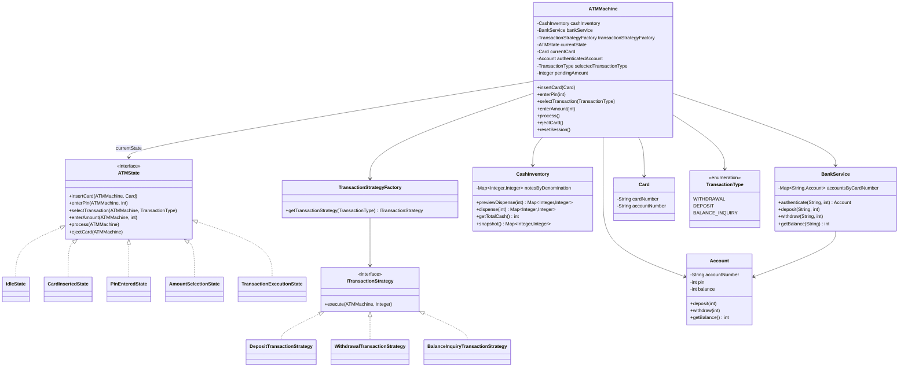
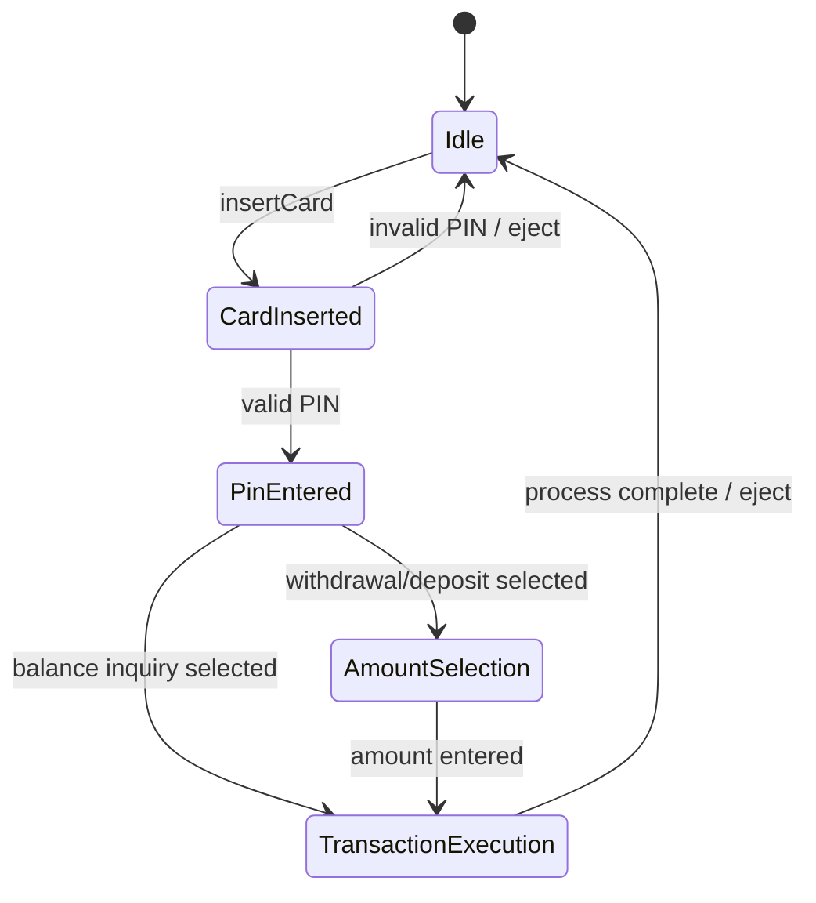

# ATM Design Architecture

## Overview
This ATM design models the machine as a **state-driven workflow** with clear separation between:
- session/state orchestration
- bank/account operations
- transaction execution
- ATM cash inventory management

The design supports:
- card insertion
- PIN authentication
- withdrawal
- deposit
- balance inquiry
- session reset/eject behavior

## High-Level Design

## State Flow

## Responsibilities

### `ATMMachine`
Acts as the coordinator for the ATM session.
- delegates user actions to the current state
- stores the active session context
- owns core dependencies like `BankService` and `CashInventory`
- resets the session after completion or failure

### `ATMState` and concrete states
Encapsulate which operations are valid at each stage.
- `IdleState`: waiting for a card
- `CardInsertedState`: waiting for PIN
- `PinEnteredState`: transaction selection allowed
- `AmountSelectionState`: amount entry for amount-based transactions
- `TransactionExecutionState`: executes and terminates the session

This avoids large `if/else` chains in the ATM machine.

### `TransactionStrategyFactory` and transaction strategies
Encapsulate transaction-specific behavior.
- `DepositTransactionStrategy`
- `WithdrawalTransactionStrategy`
- `BalanceInquiryTransactionStrategy`

This makes it easier to add new transaction types later.

### `BankService`
Represents the simulated backend banking system.
- authenticates card + PIN
- updates account balances
- returns balance information

### `CashInventory`
Owns ATM notes and dispense rules.
- validates amount
- checks ATM cash sufficiency
- computes exact note plan
- dispenses using highest denomination first

## Key Architectural Notes

### 1. State pattern for ATM workflow
The ATM behavior changes based on the current phase of the session. Using the State pattern keeps each phase isolated and reduces invalid action handling complexity.

### 2. Strategy pattern for transactions
Transaction execution logic is separated from state transitions. This prevents transaction-specific rules from bloating the ATM or state classes.

### 3. Session context lives in `ATMMachine`
The machine stores transient session data:
- inserted card
- authenticated account
- selected transaction
- pending amount

This is appropriate because these values are tied to one ATM interaction lifecycle.

### 4. Cash dispensing is separated from banking logic
`CashInventory` decides whether the ATM can physically dispense money.
`BankService` decides whether the account can afford the transaction.
Both validations are needed before a withdrawal succeeds.

### 5. Highest denomination first
`CashInventory` iterates supported notes in this order:
- `100`
- `50`
- `20`
- `10`

This implements the requirement to dispense higher denominations before lower ones.

### 6. Enum-based transaction selection
`TransactionType` is used instead of raw strings.
This improves type safety and avoids fragile string comparisons.

## Important Trade-offs / Limitations

### Demo-friendly choices
This design is intentionally simple:
- in-memory bank data
- no persistence
- console output only
- no receipt generation
- no multi-account/card lifecycle management

### Missing production concerns
For a production-grade ATM, this would still need:
- thread safety / synchronization
- transaction logging / audit trail
- rollback handling if debit succeeds and dispense fails
- card retry count and card capture rules
- proper card eject state/device abstraction
- hardware abstraction for card reader/cash dispenser/screen/printer
- exception hierarchy instead of generic runtime errors
- unit tests and integration tests

## Suggested Future Improvements
- Add an `EjectCardState` explicitly.
- Add `ReceiptService` and transaction history.
- Introduce a `TransactionResult` object instead of printing directly.
- Add a hardware abstraction layer:
  - `CardReader`
  - `CashDispenserDevice`
  - `Display`
  - `DepositSlot`
- Add a dedicated `Session` object if session state grows further.
- Use interfaces for `BankService` to improve testability.
- Add balance inquiry without routing through execution side effects if desired.

## Withdrawal Validation Sequence
For withdrawal, the system effectively validates in this order:
1. card is inserted
2. PIN is authenticated
3. transaction type is selected
4. amount is entered
5. account has sufficient balance
6. ATM has enough total cash
7. amount can be dispensed exactly
8. cash is dispensed and account is debited

## Interview Notes
If explaining this in an interview, highlight:
- use of **State pattern** for workflow control
- use of **Strategy pattern** for transaction extensibility
- separation of **bank validation** vs **cash dispensing validation**
- enum-based modeling for type safety
- easy extension path for new transaction types like mini statement or fund transfer
