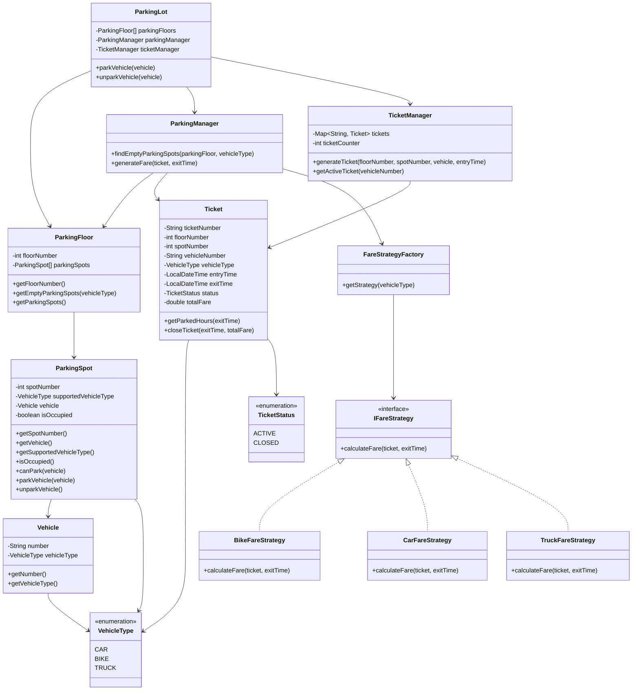

# Parking System Design



```mermaid
flowchart TD
    A[Vehicle arrives] --> B[ParkingLot.parkVehicle(vehicle)]
    B --> C[ParkingManager finds empty compatible spot floor by floor]
    C --> D[ParkingSpot parks vehicle]
    D --> E[TicketManager generates active ticket]
    E --> F[Vehicle exits]
    F --> G[ParkingLot.unparkVehicle(vehicle)]
    G --> H[TicketManager fetches active ticket]
    H --> I[ParkingSpot is freed]
    I --> J[ParkingManager selects fare strategy]
    J --> K[FareStrategy calculates fare]
    K --> L[Ticket closes with exit time and total fare]
```
