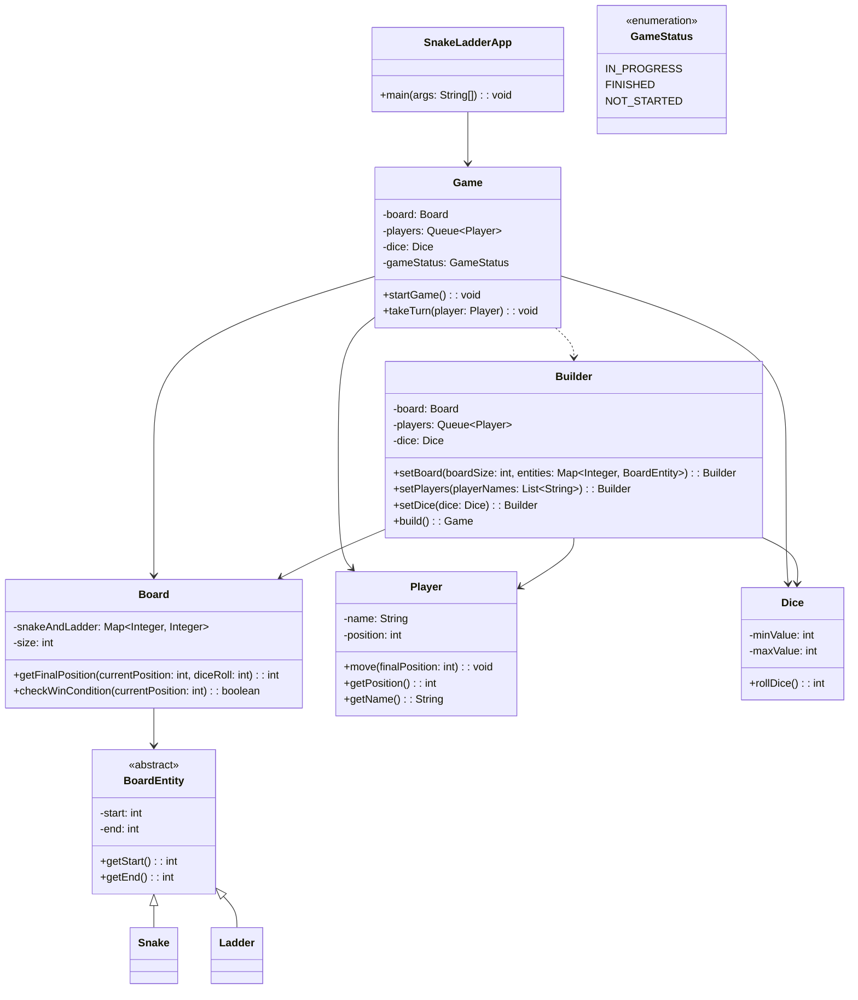

# Snake and Ladder Architecture

## Overview
The system models a turn-based Snake and Ladder game using a small set of domain objects.

## Components
- `SnakeLadderApp`: entry point, prepares sample data and starts the game.
- `Game`: orchestrates the gameplay loop and player turns.
- `Game.Builder`: constructs a valid `Game` object.
- `Board`: owns board size and transition rules for snakes and ladders.
- `BoardEntity`: base abstraction for board transitions.
- `Snake` / `Ladder`: concrete board entities.
- `Player`: stores player identity and current position.
- `Dice`: encapsulates dice rolling behavior.

## Mermaid Diagram

## Flow
1. `SnakeLadderApp` creates snakes, ladders, player names, and dice.
2. `Game.Builder` assembles the `Game`.
3. `Game.startGame()` runs a loop until a player reaches the final cell.
4. On each turn, `Dice` generates a roll.
5. `Board` resolves the next position and applies any snake or ladder jump.
6. `Player` state is updated.

## Current Strengths
- Simple and easy to understand.
- Good separation between orchestration, board rules, and player state.
- Easy to extend for different board sizes or dice behavior.
