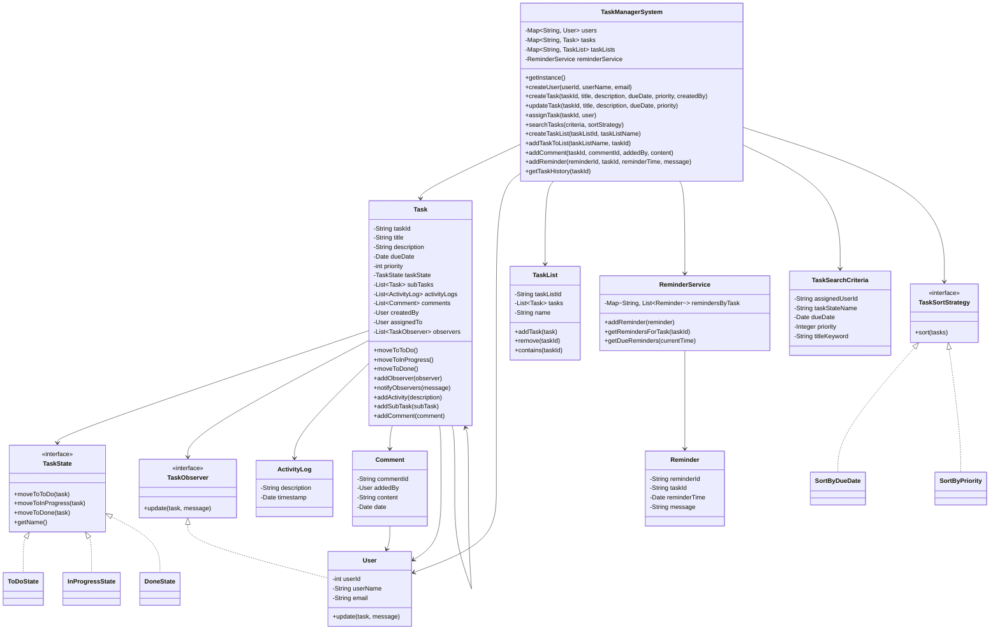
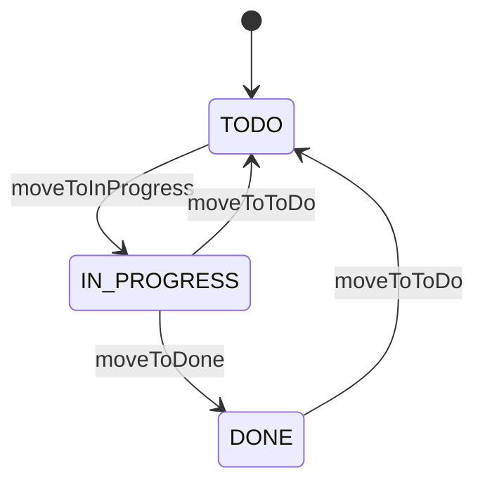
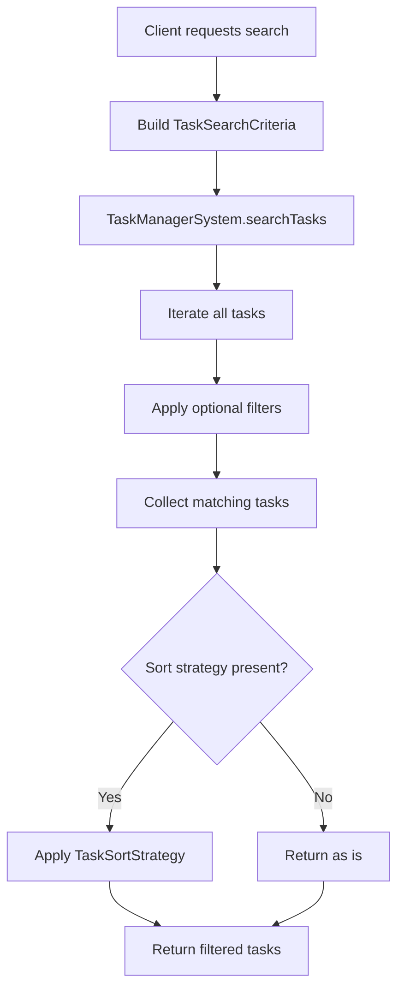
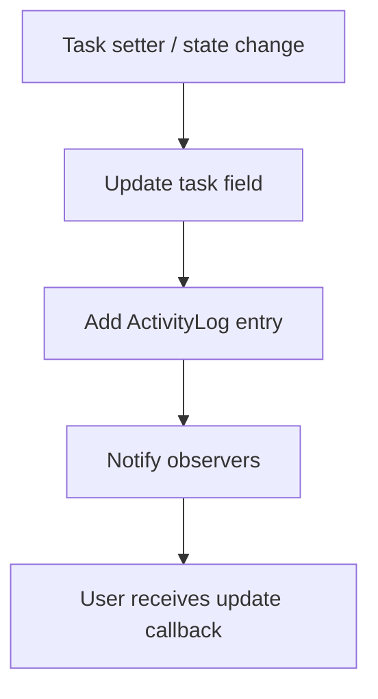

# Task Manager Architecture

## Overview
This design models a task management system with clear separation between:
- task lifecycle and state transitions
- notifications through observers
- searching and sorting
- task list organization
- reminders and activity history

The design supports:
- creating, updating, assigning, and deleting tasks
- grouping tasks into lists
- moving tasks through `TODO`, `IN_PROGRESS`, and `DONE`
- notifying interested users on important updates
- searching/filtering tasks by multiple criteria
- sorting search results using strategy classes
- adding comments, subtasks, reminders, and activity logs

## High-Level Design

## State Flow

## Search and Sort Flow

## Notification and History Flow

## Responsibilities

### `TaskManagerSystem`
Acts as the central coordinator.
- stores users, tasks, and task lists
- creates and updates tasks
- handles assignment, comments, reminders, and list operations
- exposes search and history APIs
- owns reminder service

### `Task`
Represents the core domain object.
- stores task data
- manages state transitions
- logs activity history
- manages observers
- supports comments and subtasks

### `TaskState` and concrete states
Encapsulate valid lifecycle transitions.
- `ToDoState`
- `InProgressState`
- `DoneState`

This avoids putting transition logic into `if/else` blocks.

### `TaskObserver` and `User`
Used for notifications.
- a `Task` notifies all registered observers after important updates
- `User` acts as a simple observer implementation

### `TaskSearchCriteria`
Encapsulates optional filters.
- assigned user
- state name
- due date
- priority
- title keyword

This keeps search extensible.

### `TaskSortStrategy`
Encapsulates different sorting behaviors.
- `SortByDueDate`
- `SortByPriority`

This avoids hardcoding sort rules into the search method.

### `ReminderService`
Manages reminders separately from the task object.
- stores reminders by task
- returns reminders for a task
- returns reminders due at a given time

### `ActivityLog`
Captures task history.
- title changes
- due date changes
- assignment changes
- state transitions
- comments added
- reminders added

## Key Architectural Notes

### 1. State pattern for task lifecycle
Task behavior changes with lifecycle stage. State classes keep transitions explicit and valid.

### 2. Observer pattern for notifications
Observers are notified after important setter-based changes or state changes. This is intentionally simple and interview-friendly.

### 3. Strategy pattern for sorting
Sorting is pluggable and independent of filtering logic.

### 4. Singleton for central manager
`TaskManagerSystem` acts as a single in-memory coordinator for the demo.

### 5. Activity history separated from notifications
History is stored in `ActivityLog`, while observer notifications are runtime reactions.

### 6. Reminder management separated from task entity
This keeps the task model from becoming overloaded.

## Trade-offs / Limitations

This is still a demo-oriented design:
- in-memory storage only
- notifications print to console through `User.update(...)`
- no persistence layer
- no authentication/authorization
- no background scheduler for reminders

## Suggested Production Enhancements
- add repository layer for persistence
- use UUIDs instead of plain string/manual IDs
- model watchers separately from assignee/creator
- add notification service abstraction
- use indexes for faster task search at scale
- add access control and project/team boundaries
- schedule reminders asynchronously with a worker or job system
