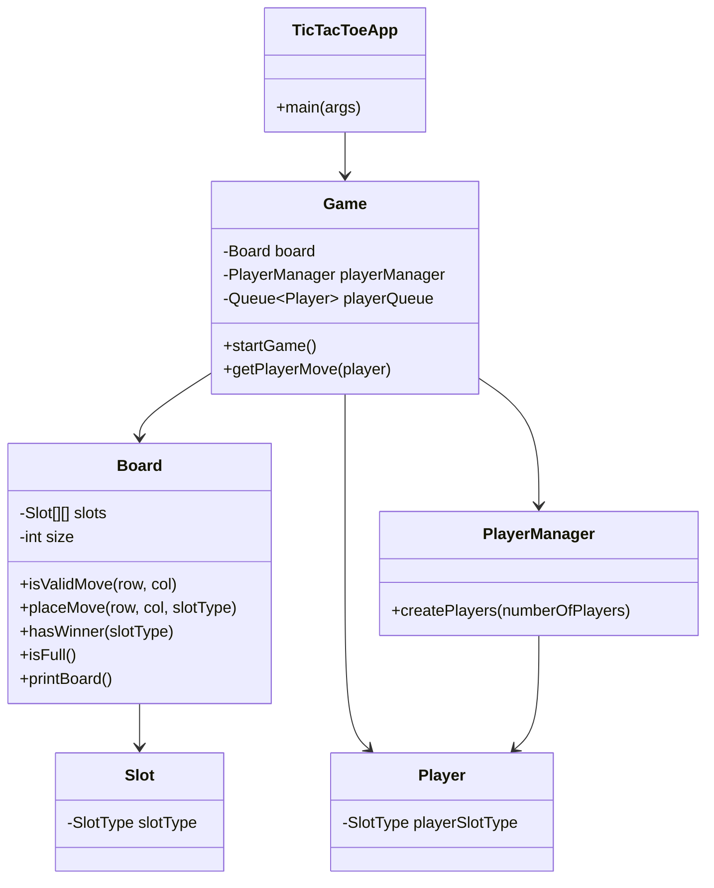
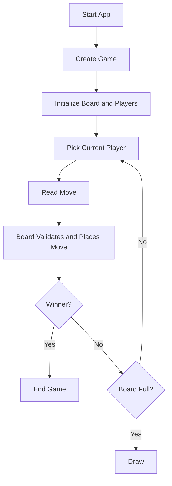

# TicTacToe Design

```mermaid
classDiagram
	class TicTacToeApp {
		+main(args)
	}

	class Game {
		-Board board
		-PlayerManager playerManager
		-Queue~Player~ playerQueue
		+startGame()
		+getPlayerMove(player)
	}

	class Board {
		-Slot[][] slots
		-int size
		+isValidMove(row, col)
		+placeMove(row, col, slotType)
		+hasWinner(slotType)
		+isFull()
		+printBoard()
	}

	class Player {
		-SlotType playerSlotType
	}

	class PlayerManager {
		+createPlayers(numberOfPlayers)
	}

	class Slot {
		-SlotType slotType
	}

	TicTacToeApp --> Game
	Game --> Board
	Game --> PlayerManager
	Game --> Player
	PlayerManager --> Player
	Board --> Slot
```

```mermaid
flowchart TD
	A[Start App] --> B[Create Game]
	B --> C[Initialize Board and Players]
	C --> D[Pick Current Player]
	D --> E[Read Move]
	E --> F[Board Validates and Places Move]
	F --> G{Winner?}
	G -- Yes --> H[End Game]
	G -- No --> I{Board Full?}
	I -- Yes --> J[Draw]
	I -- No --> D
```
