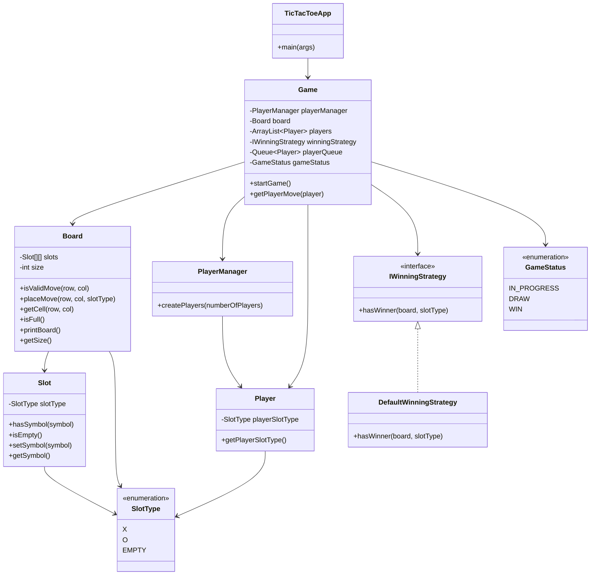
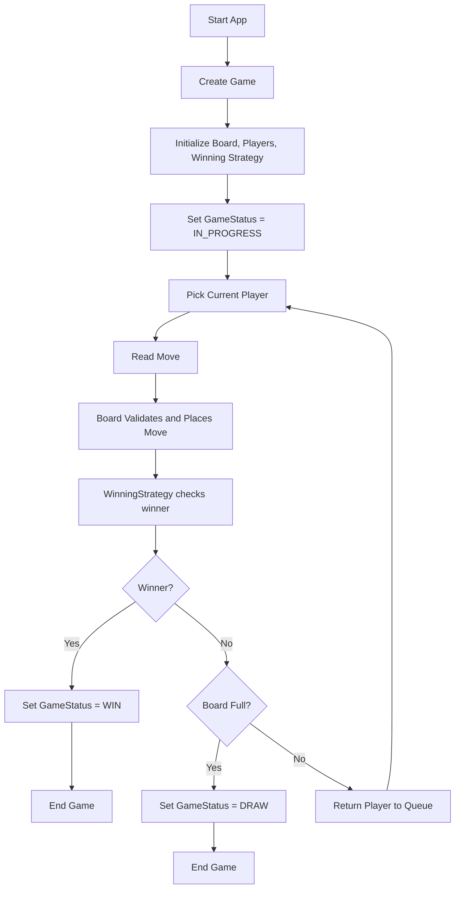

# TicTacToe Design

```mermaid
classDiagram
	class TicTacToeApp {
		+main(args)
	}

	class GameStatus {
		<<enumeration>>
		IN_PROGRESS
		DRAW
		WIN
	}

	class Game {
		-PlayerManager playerManager
		-Board board
		-ArrayList~Player~ players
		-IWinningStrategy winningStrategy
		-Queue~Player~ playerQueue
		-GameStatus gameStatus
		+startGame()
		+getPlayerMove(player)
	}

	class Board {
		-Slot[][] slots
		-int size
		+isValidMove(row, col)
		+placeMove(row, col, slotType)
		+getCell(row, col)
		+isFull()
		+printBoard()
		+getSize()
	}

	class Player {
		-SlotType playerSlotType
		+getPlayerSlotType()
	}

	class PlayerManager {
		+createPlayers(numberOfPlayers)
	}

	class IWinningStrategy {
		<<interface>>
		+hasWinner(board, slotType)
	}

	class DefaultWinningStrategy {
		+hasWinner(board, slotType)
	}

	class SlotType {
		<<enumeration>>
		X
		O
		EMPTY
	}

	class Slot {
		-SlotType slotType
		+hasSymbol(symbol)
		+isEmpty()
		+setSymbol(symbol)
		+getSymbol()
	}

	TicTacToeApp --> Game
	Game --> Board
	Game --> PlayerManager
	Game --> Player
	Game --> IWinningStrategy
	Game --> GameStatus
	PlayerManager --> Player
	IWinningStrategy <|.. DefaultWinningStrategy
	Board --> Slot
	Board --> SlotType
	Player --> SlotType
	Slot --> SlotType
```

```mermaid
flowchart TD
	A[Start App] --> B[Create Game]
	B --> C[Initialize Board, Players, Winning Strategy]
	C --> D[Set GameStatus = IN_PROGRESS]
	D --> E[Pick Current Player]
	E --> F[Read Move]
	F --> G[Board Validates and Places Move]
	G --> H[WinningStrategy checks winner]
	H --> I{Winner?}
	I -- Yes --> J[Set GameStatus = WIN]
	J --> K[End Game]
	I -- No --> L{Board Full?}
	L -- Yes --> M[Set GameStatus = DRAW]
	M --> N[End Game]
	L -- No --> O[Return Player to Queue]
	O --> E
```
