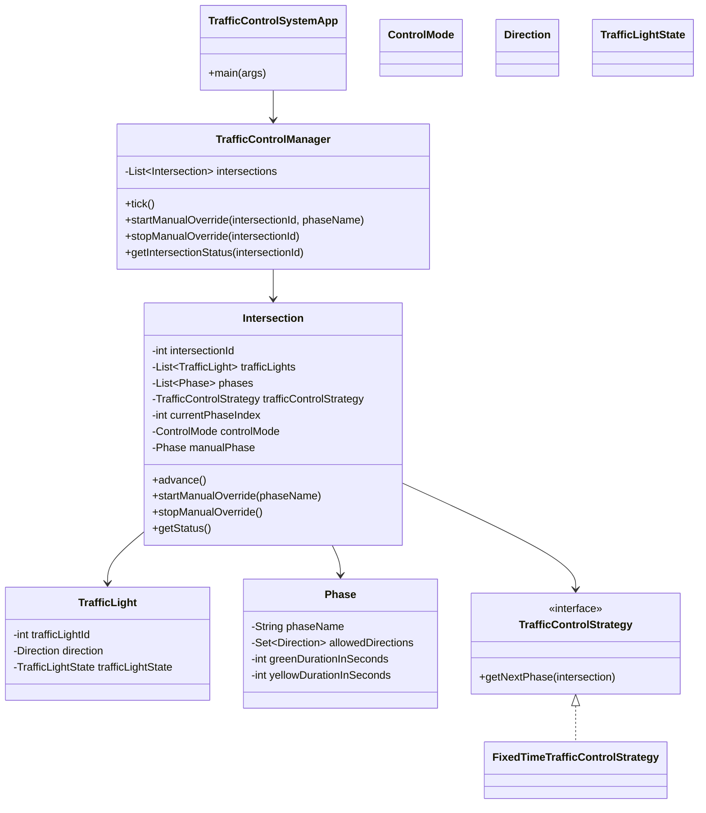
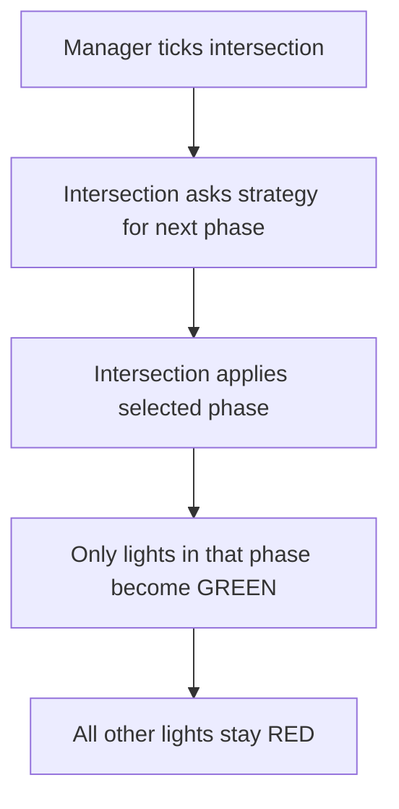

# Traffic Control System Architecture

```mermaid
classDiagram
    class TrafficControlSystemApp {
        +main(args)
    }

    class TrafficControlManager {
        -List~Intersection~ intersections
        +tick()
        +startManualOverride(intersectionId, phaseName)
        +stopManualOverride(intersectionId)
        +getIntersectionStatus(intersectionId)
    }

    class Intersection {
        -int intersectionId
        -List~TrafficLight~ trafficLights
        -List~Phase~ phases
        -TrafficControlStrategy trafficControlStrategy
        -int currentPhaseIndex
        -ControlMode controlMode
        -Phase manualPhase
        +advance()
        +startManualOverride(phaseName)
        +stopManualOverride()
        +getStatus()
    }

    class TrafficLight {
        -int trafficLightId
        -Direction direction
        -TrafficLightState trafficLightState
    }

    class Phase {
        -String phaseName
        -Set~Direction~ allowedDirections
        -int greenDurationInSeconds
        -int yellowDurationInSeconds
    }

    class TrafficControlStrategy {
        <<interface>>
        +getNextPhase(intersection)
    }

    class FixedTimeTrafficControlStrategy
    class ControlMode
    class Direction
    class TrafficLightState

    TrafficControlSystemApp --> TrafficControlManager
    TrafficControlManager --> Intersection
    Intersection --> TrafficLight
    Intersection --> Phase
    Intersection --> TrafficControlStrategy
    TrafficControlStrategy <|.. FixedTimeTrafficControlStrategy
```

```mermaid
flowchart TD
    A[Manager ticks intersection] --> B[Intersection asks strategy for next phase]
    B --> C[Intersection applies selected phase]
    C --> D[Only lights in that phase become GREEN]
    D --> E[All other lights stay RED]
```