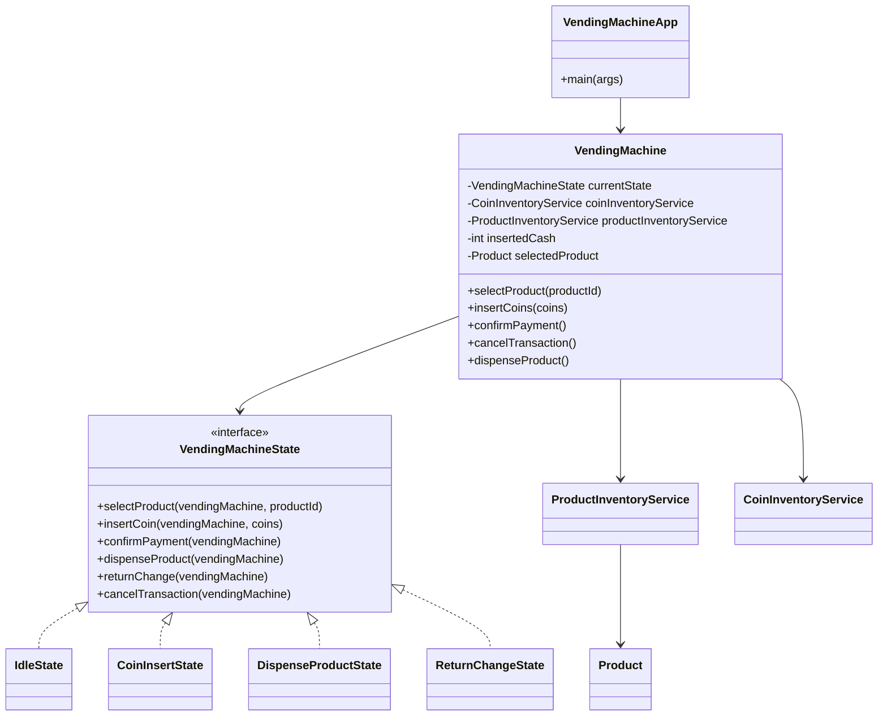
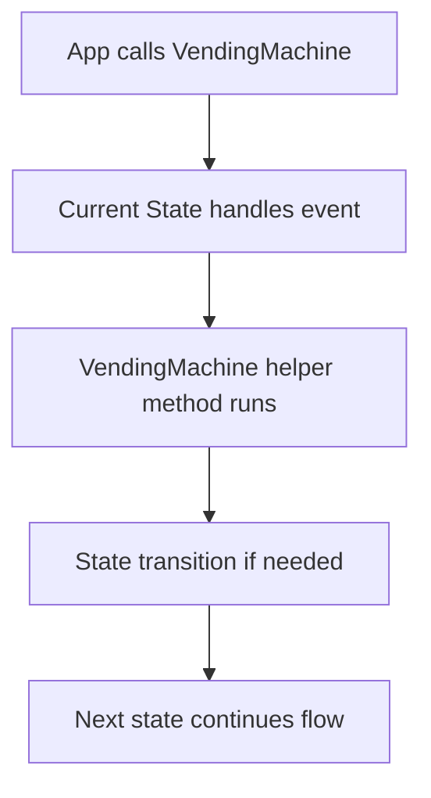

# Vending Machine Architecture

```mermaid
classDiagram
    class VendingMachineApp {
        +main(args)
    }

    class VendingMachine {
        -VendingMachineState currentState
        -CoinInventoryService coinInventoryService
        -ProductInventoryService productInventoryService
        -int insertedCash
        -Product selectedProduct
        +selectProduct(productId)
        +insertCoins(coins)
        +confirmPayment()
        +cancelTransaction()
        +dispenseProduct()
    }

    class VendingMachineState {
        <<interface>>
        +selectProduct(vendingMachine, productId)
        +insertCoin(vendingMachine, coins)
        +confirmPayment(vendingMachine)
        +dispenseProduct(vendingMachine)
        +returnChange(vendingMachine)
        +cancelTransaction(vendingMachine)
    }

    class IdleState
    class CoinInsertState
    class DispenseProductState
    class ReturnChangeState
    class Product
    class ProductInventoryService
    class CoinInventoryService

    VendingMachineApp --> VendingMachine
    VendingMachine --> VendingMachineState
    VendingMachineState <|.. IdleState
    VendingMachineState <|.. CoinInsertState
    VendingMachineState <|.. DispenseProductState
    VendingMachineState <|.. ReturnChangeState
    VendingMachine --> ProductInventoryService
    VendingMachine --> CoinInventoryService
    ProductInventoryService --> Product
```

```mermaid
flowchart TD
    A[App calls VendingMachine] --> B[Current State handles event]
    B --> C[VendingMachine helper method runs]
    C --> D[State transition if needed]
    D --> E[Next state continues flow]
```
